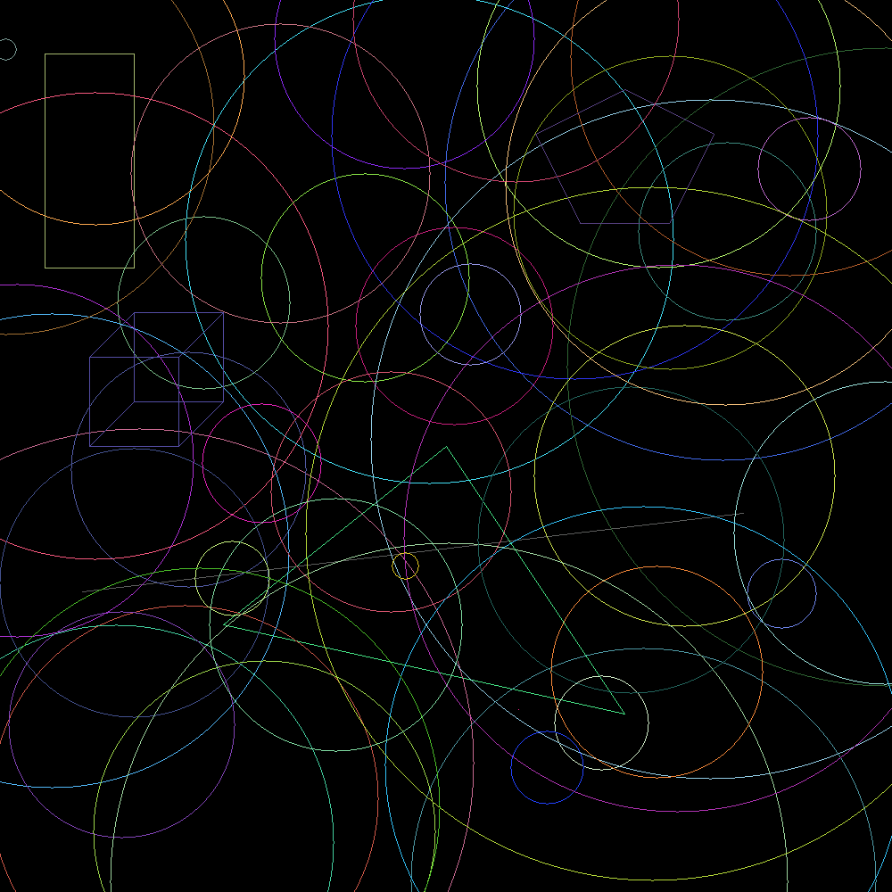

# Drawing Project

A Rust program that draws geometrical shapes onto a 1000×1000 PNG image using the `raster` crate.

## Requirements

- [Rust](https://www.rust-lang.org/tools/install) (edition 2024)
- Cargo (included with Rust)

## Build & Run

```bash
# Navigate to the project directory
cd geometrical_shapes_project

# Build the project
cargo build

# Run the program (writes image.png in this directory)
cargo run
```

The program writes **`image.png`** in the crate root (current working directory when you run `cargo run`).

## Sample output

Example frame from one run (your `cargo run` output will differ because shapes and colors are randomized):



## Project Structure

```
├── src/
│   ├── main.rs                  # Entry point — assembles and draws shapes
│   └── geometrical_shapes.rs    # Shape structs, traits, draw logic, tests
├── Cargo.toml
└── image.png                    # Generated output (created on run)
```

## Dependencies

| Crate | Version | Purpose |
|-------|---------|---------|
| `raster` | 0.2 | Image creation and PNG export |
| `rand` | 0.4 | Random positions, radii, and colors |

## Tests

```bash
cargo test
```

This will run the tests in the `src/geometrical_shapes.rs` file.

## Documentation

Full project notes what is drawn, APIs and traits are in **[docs/PROJECT.md](docs/PROJECT.md)**.

## Authors

- [cgkaldan - Christos Gkaldanidis](https://github.com/cgaldan)
- [sntentop - Stefanos Ntentopoulos](https://github.com/StephanosNt)
- [vparikog - Vasileios Parikoglou](https://github.com/vparik)
